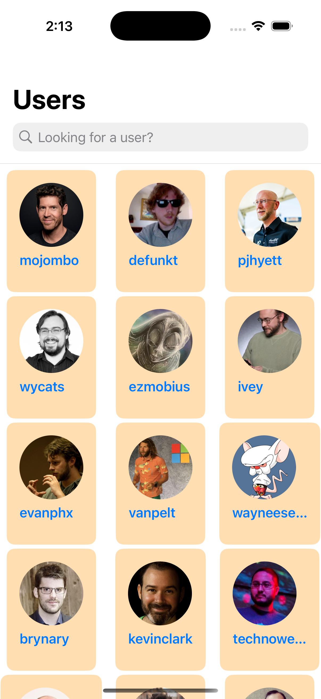

---
# GitHub Users iOS App

This is an iOS application built with Swift, following **MVVM (Model-View-ViewModel)** design pattern and **Clean Architecture** principles. The app displays a list of GitHub users and their details in an intuitive and user-friendly interface.
---

## Features

- Fetch and display a list of GitHub users.
- View details of a selected GitHub user.
- Fully responsive and optimized for all iPhone screen sizes.
- Built using **MVVM** and **Clean Architecture** to ensure scalability and maintainability.
- Can use this project as Template for future projects

---

## Architecture

This project implements **MVVM** and adheres to **Clean Architecture** principles to ensure:

1. **Separation of Concerns**

   - Business logic is isolated from the UI.
   - Network requests and data handling are abstracted into their own layers.

2. **Testability**

   - Decoupled layers make unit testing straightforward.

3. **Scalability**
   - The architecture supports easy addition of new features with minimal impact on existing code.

---

### Layers

1. **Presentation Layer**

   - Contains SwiftUI Views and ViewModels.
   - Handles UI updates and user interactions.

2. **Domain Layer**

   - Encapsulates business logic and use cases.
   - Includes protocols for interacting with the data layer.

3. **Data Layer**
   - Manages network requests and data persistence.
   - Includes API services and repository implementations.

---

## Screenshots

1. **User List Screen**
   - 

---

## Technologies Used

- **Swift**: Programming language.
- **SwiftUI**: UI framework.
- **Combine**: For managing asynchronous events.
- **Clean Architecture**: Ensures maintainable and scalable code.
- **MVVM**: Design pattern for clear separation of concerns.
- **GitHub REST API**: To fetch GitHub user data.

---

## Installation

1. Clone the repository:
   ```bash
   git clone git@github.com:RefatIbnAnwar/RH-Github-Public.git
   ```
2. Navigate to the project directory:
   ```bash
   cd RH-Github-Public
   ```
3. Open the `.xcodeproj` file in Xcode:
   ```bash
   open RH-Github-Public.xcodeproj
   ```
4. Change the API_key with your token in APIConstant.swift file

   ```swift
   static let apiKey : String = "api_key"

   ```

5. Build and run the app on a simulator or a physical device.

---

## Usage

1. Launch the app.
2. Browse through the list of GitHub users.
3. Tap on a user to view their details.

---

<!-- ## Unit Tests

The app includes unit tests to ensure reliability and correctness. To run the tests:

1. Open the project in Xcode.
2. Press `Command + U` to run the test suite. -->

---

## Future Enhancements

- Add a search feature to find users by username.
- Add offline support using CoreData or another persistence library.

---

## Contributing

Contributions are welcome! Please follow these steps:

1. Fork the repository.
2. Create a new branch:

   ```bash
   git checkout -b feature/your-feature-name
   ```

3. Commit your changes:
   ```bash
   git commit -m "Add your message here"
   ```
4. Push the branch:
   ```bash
   git push origin feature/your-feature-name
   ```
5. Open a Pull Request.

---

## License

This project is licensed under the MIT License. See the [LICENSE](LICENSE) file for details.

---

## Contact

For questions or feedback, feel free to reach out:

- **Email**: refatibnanwar@gmail.com
- **GitHub**: [@RefatIbnAnwar](https://github.com/RefatIbnAnwar)

---
